# Parts Pedigree app

# Prerequisistes

## Common
* [Node.js](https://nodejs.org/en/download/)
* [Watchman](https://facebook.github.io/watchman/docs/install.html)

## iOs

* [Xcode](https://developer.apple.com/download/)

## Android

* [Java SE Development Kit (JDK)](http://www.oracle.com/technetwork/java/javase/downloads/jdk8-downloads-2133151.html)

* [Android Studio](https://developer.android.com/studio/index.html). Choose a "Custom" setup when prompted to select an installation type. Make sure the boxes next to all of the following are checked:
    * Android SDK
    * Android SDK Platform
    * Performance (Intel ® HAXM)
    * Android Virtual Device

## More info    

To get more, open link: https://facebook.github.io/react-native/docs/getting-started.html.

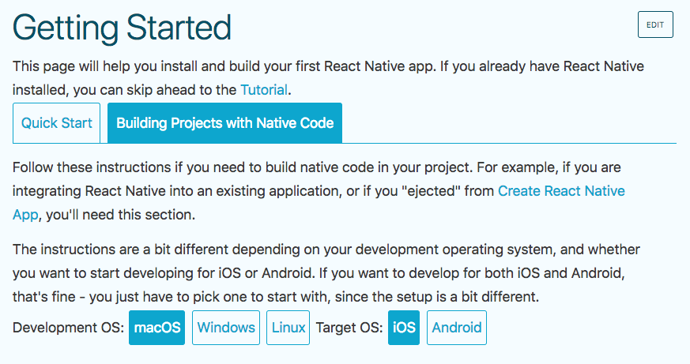

Choose tab `Building Projects with Native Code` and select appropriate `Development OS` and `Target OS`.

# Build and run the app

## Fast and easy

### iOs

`npm run emulate-ios`

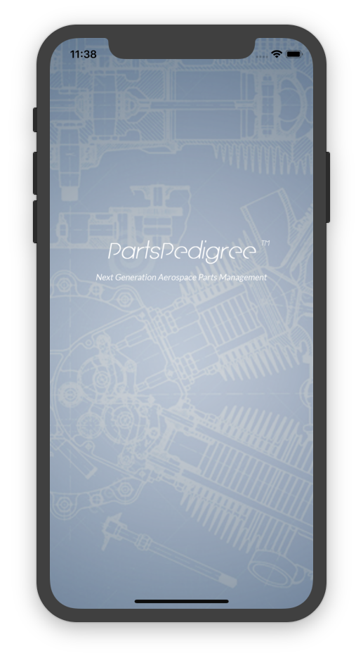
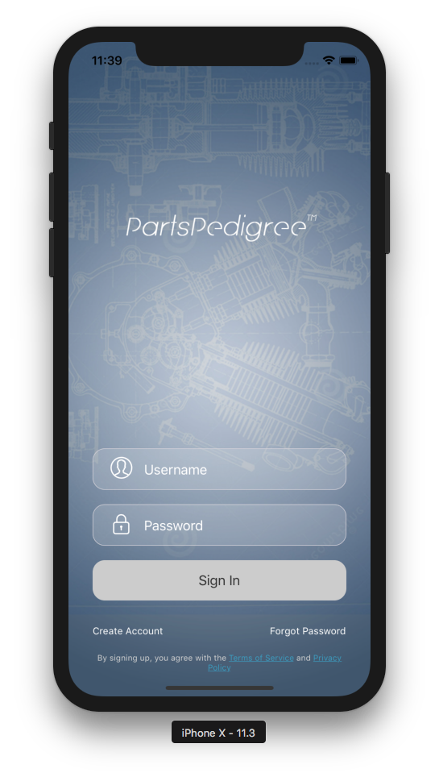

### Android

`npm run emulate-android`

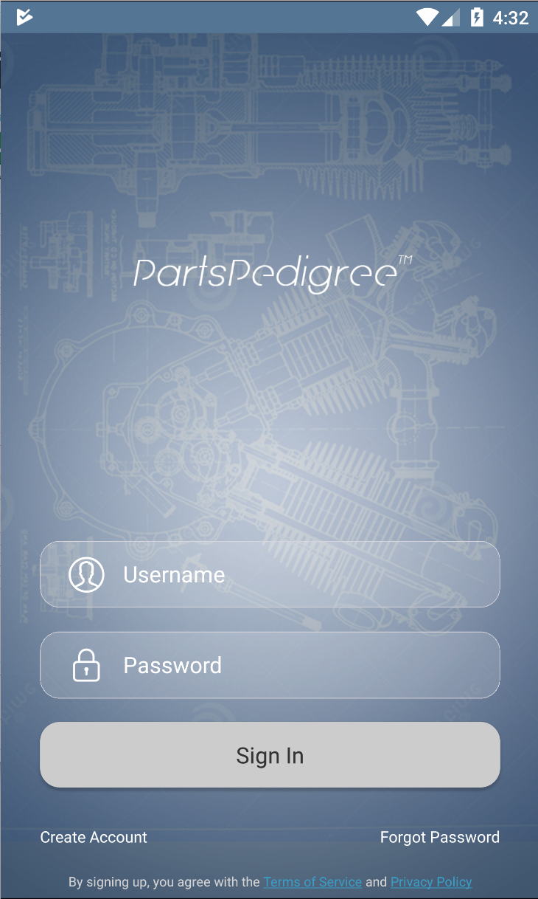 

## Advanced

### iOs

* Open `ios/PartsPedigree.xcodeproj` project dir with Xcode, right from the console: `open ios/PartsPedigree.xcodeproj`

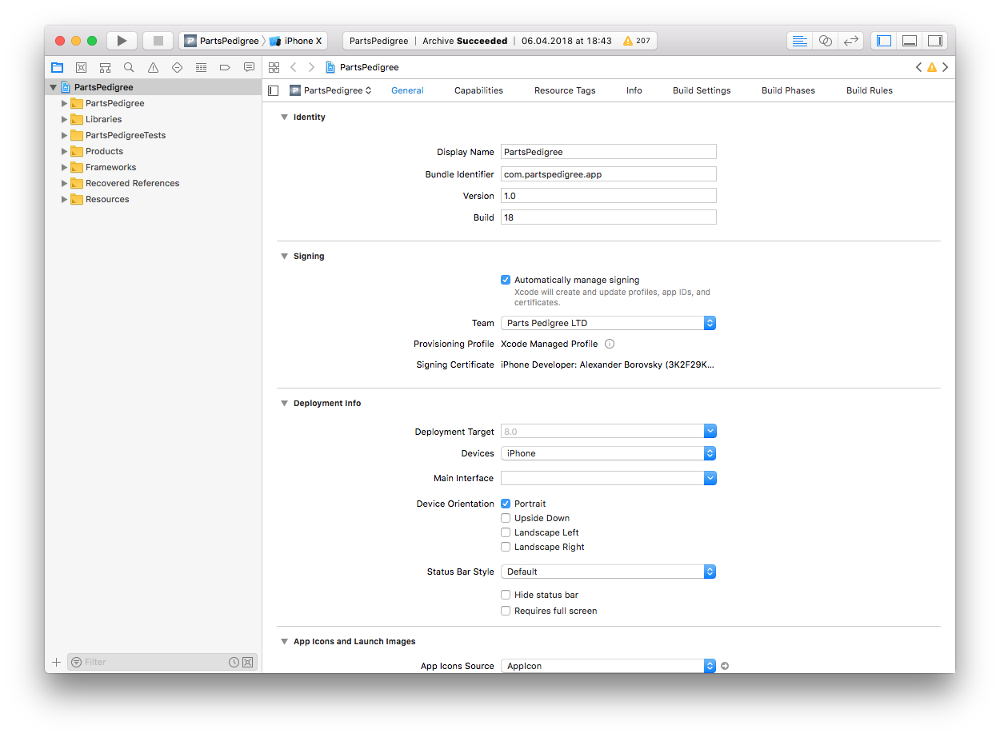

* Press `run` button in top left corner of Xcode's window.

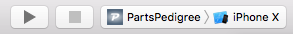


* One may choose target device: real connected iOs device or simulator:

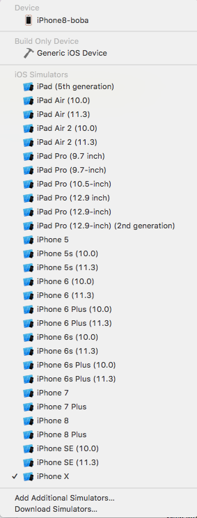

### Android

* Open `android` dir with Android Studio

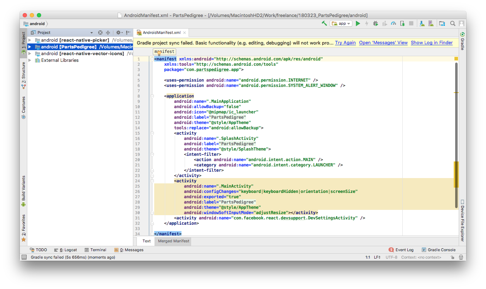

* Press `run` on `debug` button on Run/Debug palette:

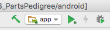

# Release

## iOs
 
* Open `ios/PartsPedigree.xcodeproj` project dir with Xcode.
* Choose `Generic iOs device` as target device:


* Run `archive target` with Xcode main menu:

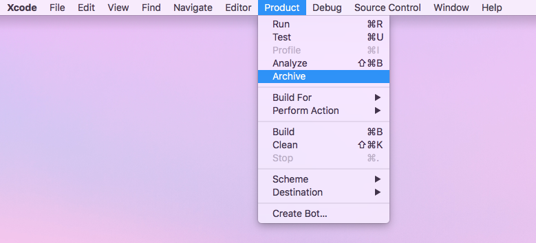

* Wait for archive process to finish. Archives organizer open up:

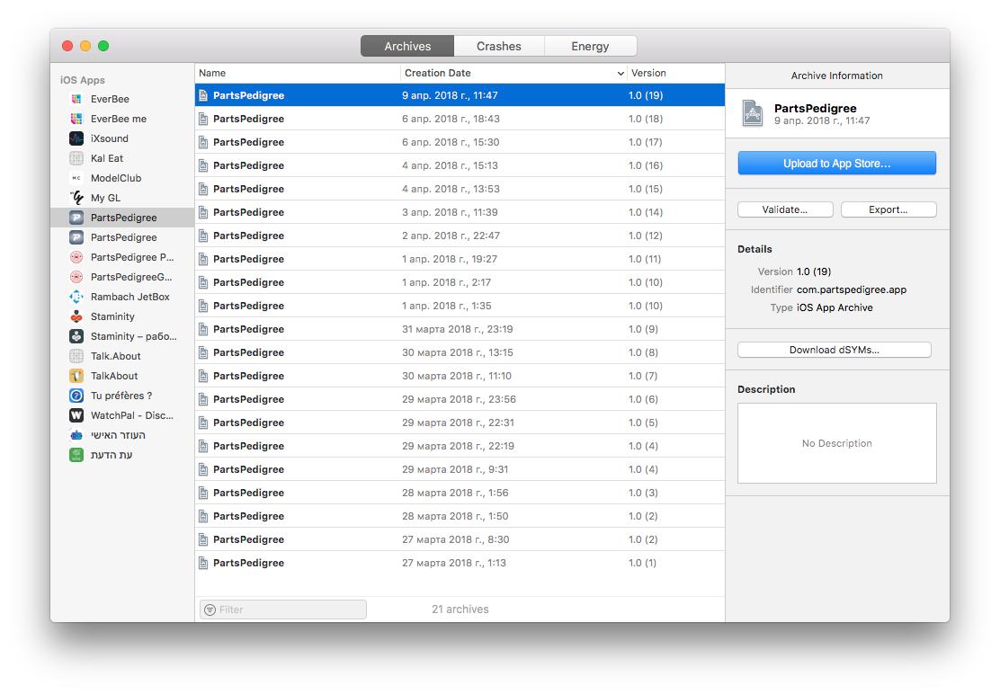

* Press `Upload to App Store...` to send the arvice to iTunesConnect portal:

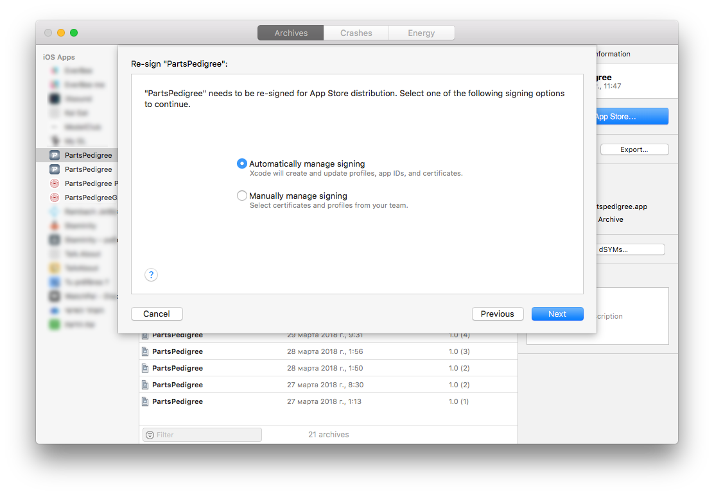
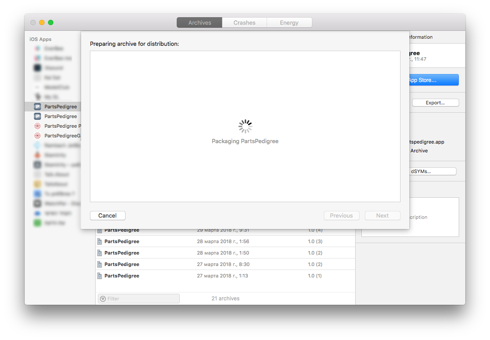
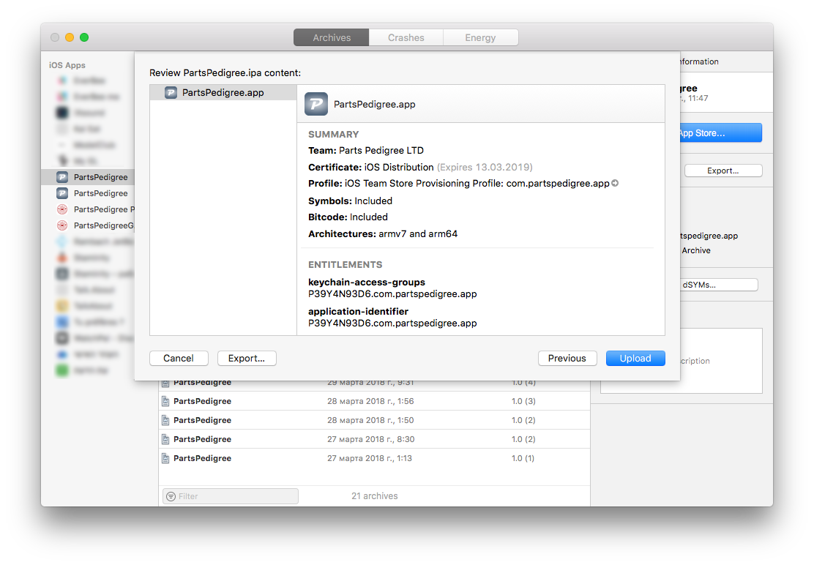
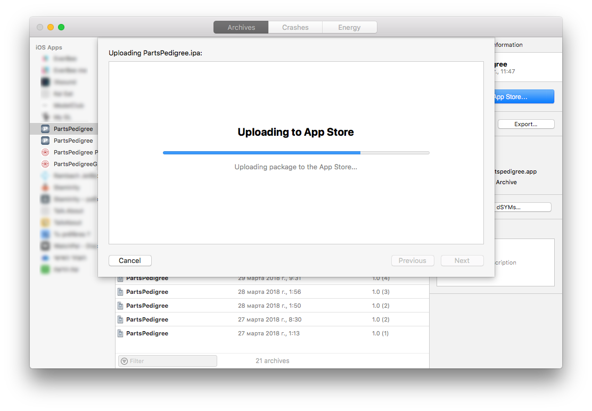
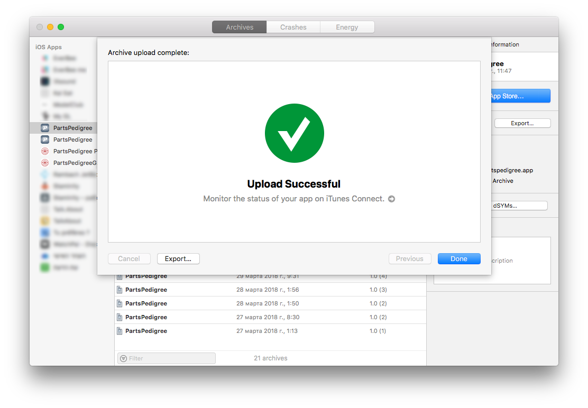

* Then go through [iTunesConnect](https://itunesconnect.apple.com) web portal to setup TestFlight or publish a release.

## Android

* Check and increments app's version in file `android/app/build.gradle`

```
android {
    ...
    defaultConfig {
        ...
        versionCode 1
        versionName "1.0"
    }
```

* Build release with command: `release-android`.
* Get apk `android/app/build/outputs/apk/app-release.apk` and upload it into Google.Play store.

# Quirks

No quirks yet :)